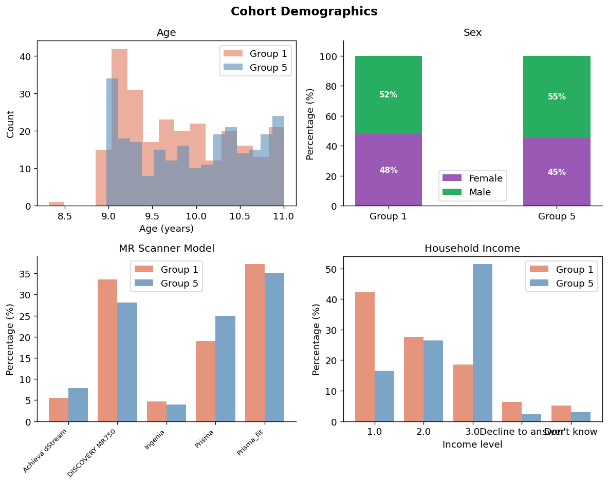
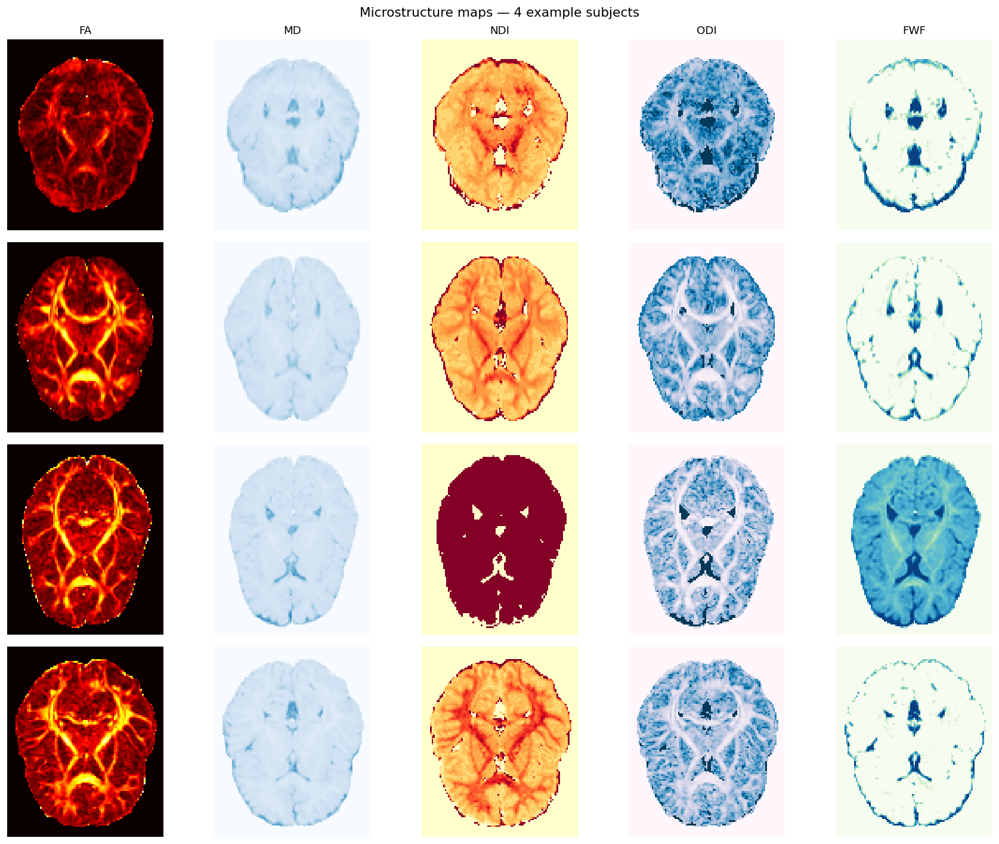
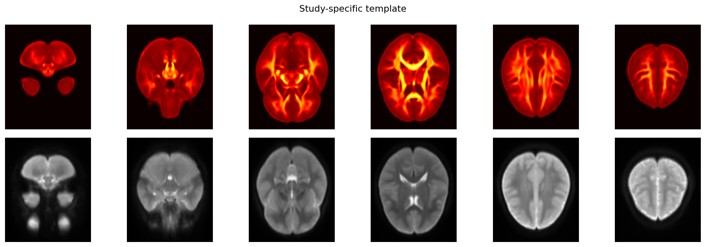
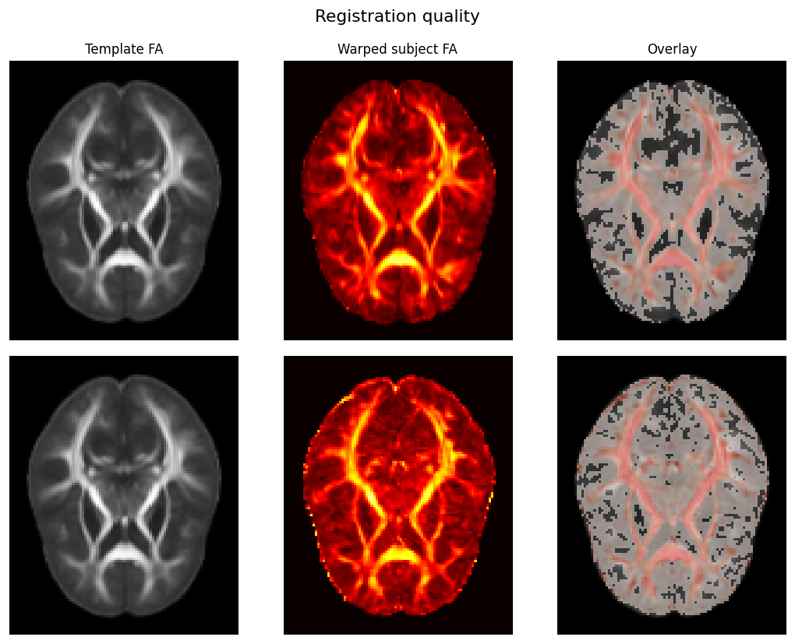
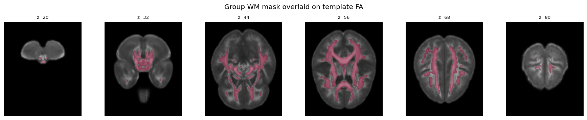

# White Matter Microstructure in Persistent Psychotic-Like Experiences

## A Voxelwise dMRI Study using ABCD 6.0 and kwneuro

> **Incomplete.** This tutorial has some incomplete sections that may be filled
> out in the future.

> **How to read this tutorial.** This document describes a real clinical study
> investigating white matter differences in adolescents with psychotic-like
> experiences. It includes illustrative Python code using the `kwneuro` library
> to demonstrate how the pipeline was implemented; the reader does not need to
> run the code to follow the study.

---

## Abstract

Using diffusion MRI data from the Adolescent Brain Cognitive Development (ABCD)
Study Release 6.0, we compared white matter microstructure between adolescents
following a persistent-distressing psychotic-like experience (PLE) trajectory
(_n_ = 253) and a normative low-symptom trajectory (_n_ = 253). Five
microstructural metrics (FA, MD, NDI, ODI, and FWF) were estimated voxelwise,
registered to a study-specific template, harmonised across 21 scanner sites with
ComBat, and compared with a voxelwise GLM controlling for age, sex, and
household income. The full pipeline was implemented in `kwneuro`, a Python
library for dMRI analysis.

---

## 1. Introduction

Persistent, distressing psychotic-like experiences (PLEs) in adolescence are
associated with elevated risk for later psychotic disorder, depression, and
functional impairment. Karcher et al. (2023) applied latent class growth
analysis to ABCD Study data and identified five PLE trajectory classes. This
study contrasts **Group 1 (persistent-distressing)** and **Group 5
(low-distressing / normative)**, to detect neurobiological correlates of early
psychotic risk.

Five dMRI metrics are derived from two biophysical models.

| Metric                             | Model | Interpretation                       |
| ---------------------------------- | ----- | ------------------------------------ |
| FA - Fractional Anisotropy         | DTI   | Directional coherence; non-specific  |
| MD - Mean Diffusivity              | DTI   | Overall displacement; non-specific   |
| NDI - Neurite Density Index        | NODDI | Intra-neurite volume fraction        |
| ODI - Orientation Dispersion Index | NODDI | Fibre fanning and crossing           |
| FWF - Free Water Fraction          | NODDI | Extracellular free-water compartment |

Analysing all five jointly disambiguates the biological source of any group
difference that a single FA map cannot resolve.

---

## 2. Study Cohort

Participants were drawn from the ABCD 6.0 baseline assessment (age 9–11 years).

|        | Group 1 — Persistent Distressing | Group 5 — Low Distressing |
| ------ | -------------------------------- | ------------------------- |
| N      | 253                              | 253                       |
| Age    | 9.80 ± 0.62 years                | 9.98 ± 0.65 years         |
| Female | 47%                              | 51%                       |

Statistical models include age, sex, and household income (3-level ordinal) as
covariates. Scanner model is treated as a batch variable and addressed via
ComBat harmonisation before statistical testing.

### Cohort Demographics

---

## 3. Analysis Pipeline

The pipeline proceeds in seven stages: (1) DWI denoising, (2) brain extraction,
(3) microstructure estimation, (4) study-specific template construction, (5)
subject-to-template registration, (6) ComBat harmonisation, and (7) voxelwise
GLM. All stages are implemented in `kwneuro`, which provides transparent
disk-based caching so that any step can be rerun in isolation after a parameter
change.

### 3.1 Preprocessing and Microstructure Estimation

Denoising (Patch2Self), brain extraction (HD-BET), and microstructure estimation
(DTI + NODDI) are run per subject. The `Cache` context manager handles
checkpointing so the batch loop is safely restartable.

The figure below shows the five metric maps for four representative subjects —
two from each group — all at the same axial slice.

### 3.2 Study-Specific Template Construction

A balanced subset of **25 subjects per group** (50 total) was selected with a
fixed random seed to ensure neither group dominates the template geometry. The
template is built jointly from FA and mean b=0 using iterative groupwise
registration (ANTs), capturing both white matter structure and cortical
boundaries.

Study-specific template: FA (top row) and mean b=0 (bottom row) across six axial
slices.

### 3.3 Registration to Template Space

All five metric maps for each subject are warped to template space. The
deformation is estimated jointly from subject FA and mean b=0 (multi-metric SyN;
mutual-information cost), then applied to the remaining metrics. A per-subject
white matter mask from Atropos tissue segmentation on the FA map constrains the
registration optimiser to white matter.

Registration quality: template FA, warped subject FA, and overlay for two
example subjects.

### 3.4 Group White Matter Mask

Each subject's Atropos WM mask is warped to template space using the saved
transforms. Averaging across all 506 subjects produces a voxelwise coverage
fraction; voxels covered by ≥50% of subjects form the final group analysis mask
used as the search volume for ComBat and the voxelwise GLM.

### 3.5 Scanner Harmonisation and Voxelwise Statistics

ComBat (Johnson et al., 2007; Fortin et al., 2017) is applied independently per
metric, removing site-specific additive and multiplicative effects while
preserving variance attributable to age, sex, income, and group. The voxelwise
GLM then tests:

$$\text{metric} \sim \beta_0 + \beta_1 \cdot \text{group} + \beta_2 \cdot \text{age} + \beta_3 \cdot \text{sex} + \beta_4 \cdot \text{income}$$

at each WM voxel, with FDR correction (_q_ < 0.05). Positive _t_-values on β₁
indicate higher metric in Group 1 (persistent-distressing); negative values
indicate lower metric.

Each dot below is one subject; horizontal bars are site medians. Sites are
sorted left-to-right by their pre-harmonisation grand mean FA, so any inter-site
offset is immediately visible on the left panel and should collapse on the
right.

---

## 4. Results

_To be completed_

Based on prior literature on early psychosis, the primary hypothesis is that
Group 1 will show **reduced NDI** and **elevated FWF** in frontal and callosal
white matter, reflecting lower axonal density and extracellular free-water
accumulation. A joint reduction in FA and NDI with stable ODI would localise the
effect to axonal loss rather than altered fibre geometry.

Voxelwise _t_-statistic maps for each metric (thresholded at |_t_| > 3.0; FDR
_q_ < 0.05):

---

## 5. Conclusions

| Challenge                            | kwneuro solution                                           |
| ------------------------------------ | ---------------------------------------------------------- |
| Cohort-scale preprocessing (N = 506) | Transparent per-subject caching; restartable batch loop    |
| GPU-efficient brain extraction       | `brain_extract_dwi_batch` — single model-load pass         |
| Microstructure specificity           | DTI + NODDI jointly; five complementary maps               |
| Paediatric registration target       | Study-specific template, balanced 25+25 subset             |
| Cross-subject normalisation          | Multi-metric ANTs SyN (FA + mean b=0) with Atropos WM mask |
| 21-site scanner variability          | ComBat harmonisation                                       |
| Voxelwise group comparison           | GLM + FDR, whole white matter search volume                |

---

## References

- Avants, B.B. et al. (2008). Symmetric diffeomorphic image registration with
  cross-correlation. _Medical Image Analysis_, 12(1), 26–41.
- Daducci, A. et al. (2015). AMICO: Accelerated microstructure imaging via
  convex optimization. _NeuroImage_, 105, 32–44.
- Fadnavis, S. et al. (2020). Patch2Self: Denoising diffusion MRI with
  self-supervised learning. _NeurIPS_, 33.
- Fortin, J.P. et al. (2017). Harmonization of multi-site diffusion tensor
  imaging data. _NeuroImage_, 161, 149–170.
- Isensee, F. et al. (2019). Automated brain extraction of multi-sequence MRI
  using artificial neural networks. _Human Brain Mapping_, 40(17), 4952–4964.
- Johnson, W.E., Li, C., & Rabinovic, A. (2007). Adjusting batch effects in
  microarray expression data using empirical Bayes methods. _Biostatistics_,
  8(1), 118–127.
- Karcher, N.R. et al. (2023). Trajectories of psychotic-like experiences and
  associations with outcomes in the ABCD Study. _JAMA Psychiatry_.
- Zhang, H. et al. (2012). NODDI: Practical in vivo neurite orientation
  dispersion and density imaging of the human brain. _NeuroImage_, 61(4),
  1000–1016.
