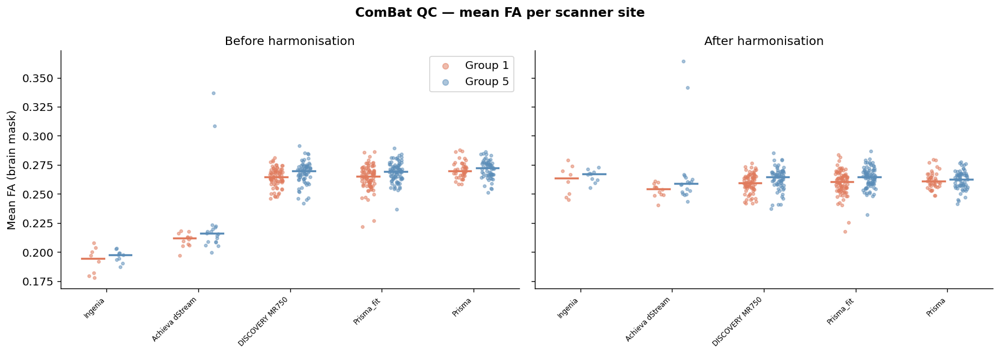

# White Matter Microstructure in Persistent Psychotic-Like Experiences

## A Voxelwise dMRI Study using ABCD 6.0 and kwneuro

> **How to read this tutorial.** This document describes a real clinical study
> investigating white matter differences in adolescents with psychotic-like
> experiences. It includes illustrative Python code using the `kwneuro` library
> to demonstrate how the pipeline was implemented - from per-subject processing,
> to population template building, to scanner harmonisation; the reader does not
> need to run the code to follow the study. The voxelwise group comparison
> itself is left as planned analyses, and is specified in §4 as the next step of
> the study.

---

## Abstract

Using diffusion MRI data from the Adolescent Brain Cognitive Development (ABCD)
Study Release 6.0, this tutorial documents a pipeline for identifying white
matter microstructural changes associated with a persistent-distressing
psychotic-like experience (PLE) trajectory (_n_ = 253), relative to a normative
low-symptom trajectory (_n_ = 253). Five microstructural metrics (FA, MD, NDI,
ODI, and FWF) were estimated voxelwise, registered to a study-specific template,
and harmonised across 21 scanner sites with ComBat. At the end of the tutorial,
we specify the voxelwise GLM, controlling for age, sex, and household income,
that will identify which metrics and regions differ between groups. The full
pipeline was implemented in `kwneuro`, a Python library for dMRI analysis.

---

## 1. Introduction

Persistent, distressing psychotic-like experiences (PLEs) in adolescence are
associated with elevated risk for later psychotic disorder, depression, and
functional impairment (Karcher, Nicole R., et al, 2022). Karcher et al. (2023)
applied latent class growth analysis to ABCD Study data and identified five PLE
trajectory classes. This study contrasts **Group 1 (persistent-distressing)**
and **Group 5 (low-distressing / normative)**, to detect neurobiological
correlates of early psychotic risk.

This tutorial demonstrates a pipeline for identifying which white matter
microstructural metrics differ between adolescents on the persistent-distressing
PLE trajectory and those on the normative trajectory. The voxelwise GLM (§4)
tests for differences across all five metrics. This is motivated by prior work
in early psychosis-spectrum experiences, which used structural MRI to show that
youth with persistent distressing psychotic-like experiences (PLEs) exhibit
cortical and subcortical patterns resembling those seen in adult schizophrenia
spectrum and Alzheimer disease samples. Building on these findings, we sought to
examine whether diffusion MRI would reveal analogous microstructural
alterations, as indexed by DTI and NODDI metrics (Karcher et al. (2023)).

Five dMRI metrics are derived from two biophysical models.

| Metric                             | Model | Interpretation                       |
| ---------------------------------- | ----- | ------------------------------------ |
| FA - Fractional Anisotropy         | DTI   | Directional coherence; non-specific  |
| MD - Mean Diffusivity              | DTI   | Overall displacement; non-specific   |
| NDI - Neurite Density Index        | NODDI | Intra-neurite volume fraction        |
| ODI - Orientation Dispersion Index | NODDI | Fibre fanning and crossing           |
| FWF - Free Water Fraction          | NODDI | Extracellular free-water compartment |

This tutorial walks through the full processing pipeline - from raw DWI through
scanner harmonisation - preparing the metrics and covariates that feed into the
voxelwise GLM specified in §4, which is outside the scope of this tutorial.

---

## 2. Study Cohort

Participants were drawn from the ABCD 6.0 baseline assessment (age 9–11 years).

|        | Group 1 — Persistent Distressing | Group 5 — Low Distressing |
| ------ | -------------------------------- | ------------------------- |
| N      | 253                              | 253                       |
| Age    | 9.80 ± 0.62 years                | 9.98 ± 0.65 years         |
| Female | 48%                              | 45%                       |

Statistical models include age, sex, and household income (3-level ordinal) as
covariates, selected to isolate group-related microstructural differences (§1)
from known confounds of white matter development. Scanner model is treated as a
batch variable and addressed via ComBat harmonisation before statistical
testing.

### Cohort Demographics


---

## 3. Analysis Pipeline

The pipeline proceeds in seven stages: (1) DWI denoising, (2) brain extraction,
(3) microstructure estimation, (4) study-specific template construction, (5)
subject-to-template registration, (6) ComBat harmonisation, and (7) voxelwise
GLM. All stages are implemented in `kwneuro`, which provides transparent
disk-based caching so that any step can be rerun in isolation after a parameter
change.

### 3.1 Preprocessing and Microstructure Estimation

Denoising (Patch2Self), brain extraction (HD-BET), and microstructure estimation
(DTI + NODDI) are run per subject. The `Cache` context manager handles
checkpointing so the batch loop is safely restartable.

```python
# Illustrative — requires access to raw DWI data
from kwneuro.cache import Cache
from kwneuro.masks import brain_extract_dwi_batch


def load_denoised_dwi(sid):
    stem = str(OUT_ROOT / sid / "dwi_denoised")
    return Dwi(
        NiftiVolumeResource(stem + ".nii.gz"),
        FslBvalResource(stem + ".bval"),
        FslBvecResource(stem + ".bvec"),
    )


# --- Denoising + brain extraction ---
cases = []
for sid in participants["participant_id"]:
    raw_dir = PROJECT_ROOT / "raw_data" / sid / "dwi"
    dwi = Dwi(
        NiftiVolumeResource(raw_dir / f"{sid}_dwi.nii.gz"),
        FslBvalResource(raw_dir / f"{sid}.bval"),
        FslBvecResource(raw_dir / f"{sid}.bvec"),
    )
    with Cache(cache_dir=OUT_ROOT / sid / "cache"):
        dwi_denoised = dwi.denoise()
    dwi_denoised.save(OUT_ROOT / sid, stem="dwi_denoised")
    cases.append((dwi_denoised, OUT_ROOT / sid / "brain_mask.nii.gz"))

brain_extract_dwi_batch(cases)  # single GPU pass over all 506 subjects

# --- DTI + NODDI per subject ---
for sid in participants["participant_id"]:
    dwi_denoised = load_denoised_dwi(sid)
    brain_mask = NiftiVolumeResource(OUT_ROOT / sid / "brain_mask.nii.gz")

    with Cache(cache_dir=OUT_ROOT / sid / "cache"):
        dti = dwi_denoised.estimate_dti(brain_mask)
        fa, md = dti.get_fa_md()
        noddi = dwi_denoised.estimate_noddi(brain_mask, dpar=1.7e-3)

    for name, arr in zip(
        ["fa", "md", "ndi", "odi", "fwf"],
        [fa, md, noddi.ndi, noddi.odi, noddi.fwf],
    ):
        NiftiVolumeResource.save(arr, OUT_ROOT / sid / f"{name}.nii.gz")
```

The figure below shows the five metric maps for four representative subjects —
two from each group — all at the same axial slice.


### 3.2 Study-Specific Template Construction

A balanced subset of **25 subjects per group** (50 total) was selected with a
fixed random seed to ensure neither group dominates the template geometry. The
template is built jointly from FA and mean b=0 using iterative groupwise
registration (ANTs), capturing both white matter structure and cortical
boundaries.

```python
# Illustrative — requires per-subject metric maps
from kwneuro.build_template import build_multi_metric_template

g1_sample = g1.sample(n=25, random_state=42)
g5_sample = g5.sample(n=25, random_state=42)
template_ids = pd.concat([g1_sample, g5_sample])["participant_id"]

subject_metrics = [
    {
        "fa": NiftiVolumeResource(OUT_ROOT / sid / "fa.nii.gz"),
        "mean_b0": load_denoised_dwi(sid).compute_mean_b0(),
    }
    for sid in template_ids
]

templates = build_multi_metric_template(subject_metrics, iterations=12)
NiftiVolumeResource.save(templates["fa"], OUT_ROOT / "template" / "template_fa.nii.gz")
NiftiVolumeResource.save(
    templates["mean_b0"], OUT_ROOT / "template" / "template_mean_b0.nii.gz"
)
```

Study-specific template: FA (top row) and mean b=0 (bottom row) across six axial
slices.


### 3.3 Registration to Template Space

All five metric maps for each subject are warped to template space. The
deformation is estimated jointly from subject FA and mean b=0 (multi-metric SyN;
mutual-information cost), then applied to the remaining metrics. A per-subject
white matter mask from Atropos tissue segmentation on the FA map constrains the
registration optimiser to white matter.

```python
# Illustrative — requires per-subject metric maps and template
from kwneuro.reg import register_volumes
from kwneuro.seg import segment_tissue_atropos

template_fa = NiftiVolumeResource(TEMPLATE_FA)
template_mean_b0 = NiftiVolumeResource(TEMPLATE_MEAN_B0)

for sid in participants["participant_id"]:
    fa = NiftiVolumeResource(OUT_ROOT / sid / "fa.nii.gz")
    brain_mask = NiftiVolumeResource(OUT_ROOT / sid / "brain_mask.nii.gz")

    tissue = segment_tissue_atropos(fa, brain_mask, n_classes=3)
    NiftiVolumeResource.save(tissue["wm"], OUT_ROOT / sid / "wm_mask.nii.gz")

    warped_fa, transform = register_volumes(
        fixed=[template_fa, template_mean_b0],
        moving=[fa, load_denoised_dwi(sid).compute_mean_b0()],
        type_of_transform="SyN",
        moving_mask=tissue["wm"],
    )
    NiftiVolumeResource.save(warped_fa, OUT_ROOT / sid / "fa_warped.nii.gz")
    transform.save(OUT_ROOT / sid / "transforms")

    for metric in ["md", "ndi", "odi", "fwf"]:
        warped = transform.apply(
            template_fa,
            NiftiVolumeResource(OUT_ROOT / sid / f"{metric}.nii.gz"),
        )
        NiftiVolumeResource.save(warped, OUT_ROOT / sid / f"{metric}_warped.nii.gz")
```

Registration quality: template FA, warped subject FA, and overlay for two
example subjects.


### 3.4 Group White Matter Mask

Each subject's Atropos WM mask is warped to template space using the saved
transforms. Averaging across all 506 subjects produces a voxelwise coverage
fraction; voxels covered by ≥50% of subjects form the final group analysis mask
used as the search volume for ComBat and the voxelwise GLM.


### 3.5 Scanner Harmonisation

ComBat (Johnson et al., 2007; Fortin et al., 2017) is applied independently per
metric, removing site-specific additive and multiplicative effects while
preserving variance attributable to age, sex, income, and group. §4 specifies
the voxelwise GLM used to test for group differences in the harmonised metric
maps.

```python
# Illustrative — requires warped metric volumes in template space
from kwneuro.harmonize import harmonize_volumes
from kwneuro.io import NiftiVolumeResource
import nibabel as nib
import pickle

GROUP_MASK = OUT_ROOT / "template" / "group_brain_mask.nii.gz"
METRICS = ["fa", "md", "ndi", "odi", "fwf"]

# Subjects with income codes 777 (decline to answer) or 999 (don't know)
# are excluded — they cannot be used as a numeric covariate.
harm_participants = participants[~participants["income"].isin([777, 999])].reset_index(
    drop=True
)

covars = pd.DataFrame(
    {
        "scanner": harm_participants["scanner"],
        "age": harm_participants["age"],
        "income": harm_participants["income"],
        "sex_bin": (harm_participants["sex"] == "F").astype(int),
        "group": harm_participants["group"],
    }
)

brain_mask = NiftiVolumeResource(GROUP_MASK)

(OUT_ROOT / "stats").mkdir(exist_ok=True)

for metric in METRICS:
    volumes = [
        NiftiVolumeResource(OUT_ROOT / sid / f"{metric}_warped.nii.gz")
        for sid in harm_participants["participant_id"]
    ]
    harmonized, estimates = harmonize_volumes(
        volumes,
        covars,
        batch_col="scanner",
        mask=brain_mask,
        continuous_cols=["age", "income", "group"],
        categorical_cols=["sex_bin"],
    )
    for sid, harm_vol in zip(harm_participants["participant_id"], harmonized):
        nib.save(
            nib.Nifti1Image(harm_vol.get_array(), harm_vol.get_affine()),
            str(OUT_ROOT / sid / f"{metric}_warped_harmonized.nii.gz"),
        )
    with open(OUT_ROOT / "stats" / f"combat_estimates_{metric}.pkl", "wb") as f:
        pickle.dump(estimates, f)
```

Each dot below is one subject; horizontal bars are site medians. Sites are
sorted left-to-right by their pre-harmonisation grand mean FA, so any inter-site
offset is immediately visible on the left panel and should collapse on the
right.



---

## 4. Results and Discussion

The pipeline above produces harmonised, template-space maps of FA, MD, NDI, ODI,
and FWF for all 506 subjects. As shown in §3.5, ComBat harmonisation removes the
site-level offsets visible in the raw metric distributions, confirming that
scanner effects are adequately controlled before any group-level comparison.

**Planned statistical analysis.** With harmonised metric maps in hand, group
differences can be identified by testing all five metrics voxelwise within the
white matter mask (§3.4):

$$\text{metric} \sim \beta_0 + \beta_1 \cdot \text{group} + \beta_2 \cdot \text{age} + \beta_3 \cdot \text{sex} + \beta_4 \cdot \text{income}$$

at each WM voxel, with FDR correction ($q < 0.05$). Positive $t$-values on
$\beta_1$ indicate higher metric in Group 1 (persistent-distressing); negative
values indicate lower metric. As motivated in §1, this test can be conducted
across all five metrics and the full white matter mask to examine whether
diffusion MRI reveals microstructural alterations analogous to the cortical and
subcortical patterns previously reported with structural MRI.

---

## References

- Karcher, Nicole R., et al. (2022). Persistent and distressing psychotic-like
  experiences using adolescent brain cognitive development study data.
  _Molecular psychiatry_ 27(3), 1490-1501.
- Karcher, N.R. et al. (2023). Trajectories of psychotic-like experiences and
  associations with outcomes in the ABCD Study. _JAMA Psychiatry_.
- Avants, B.B. et al. (2008). Symmetric diffeomorphic image registration with
  cross-correlation. _Medical Image Analysis_, 12(1), 26–41.
- Daducci, A. et al. (2015). AMICO: Accelerated microstructure imaging via
  convex optimization. _NeuroImage_, 105, 32–44.
- Fadnavis, S. et al. (2020). Patch2Self: Denoising diffusion MRI with
  self-supervised learning. _NeurIPS_, 33.
- Fortin, J.P. et al. (2017). Harmonization of multi-site diffusion tensor
  imaging data. _NeuroImage_, 161, 149–170.
- Isensee, F. et al. (2019). Automated brain extraction of multi-sequence MRI
  using artificial neural networks. _Human Brain Mapping_, 40(17), 4952–4964.
- Johnson, W.E., Li, C., & Rabinovic, A. (2007). Adjusting batch effects in
  microarray expression data using empirical Bayes methods. _Biostatistics_,
  8(1), 118–127.
- Zhang, H. et al. (2012). NODDI: Practical in vivo neurite orientation
  dispersion and density imaging of the human brain. _NeuroImage_, 61(4),
  1000–1016.
