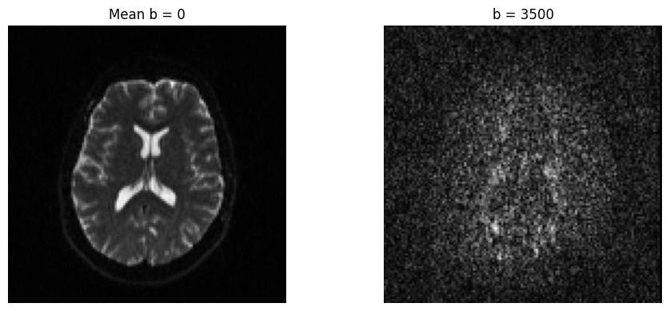
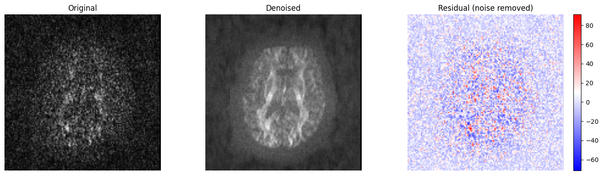
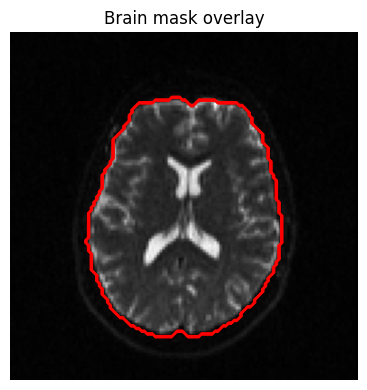
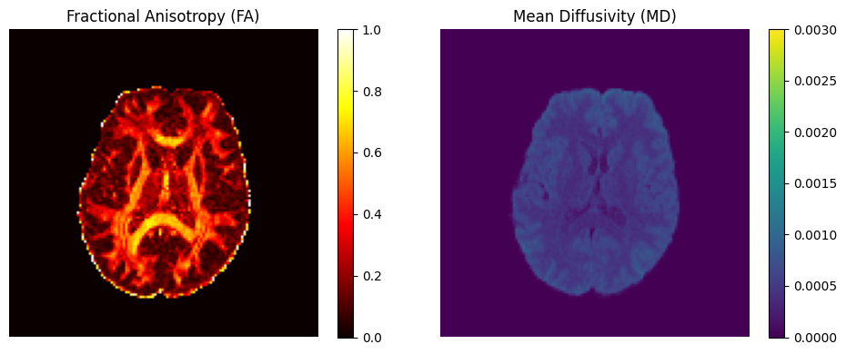
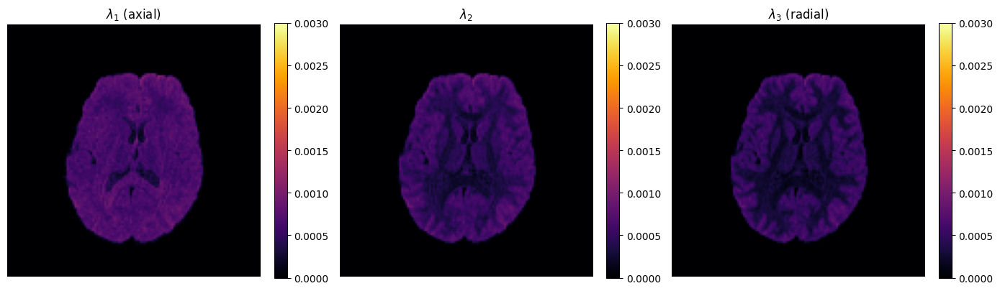
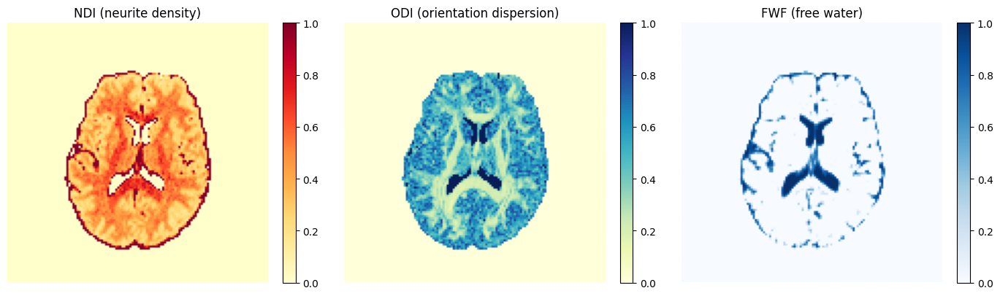
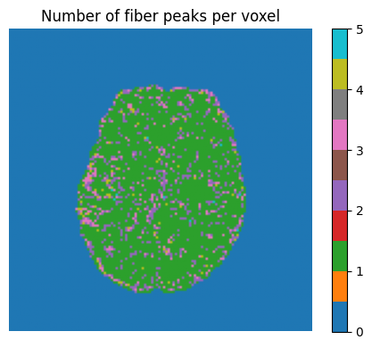
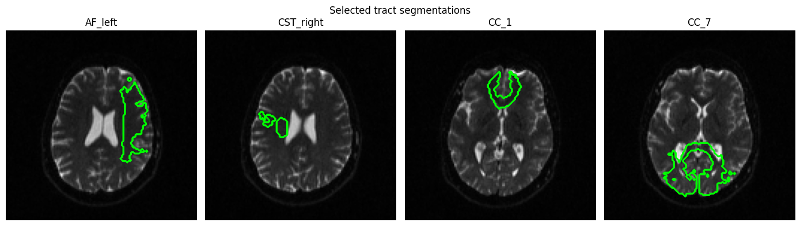

# Single-Subject Microstructure Pipeline

This notebook demonstrates the main capabilities of the `kwneuro` package
for extracting brain microstructure parameters from diffusion MRI data.

## Download example data

We use the Sherbrooke 3-shell HARDI dataset from DIPY, which provides
multi-shell diffusion data (b = 0, 1000, 2000, 3500 s/mm²) with 193 gradient
directions. Multi-shell data is required for NODDI estimation.

The data is downloaded automatically on first run (~50 MB).


```python
from dipy.data import fetch_sherbrooke_3shell

# Download the dataset if not already present
files, data_dir = fetch_sherbrooke_3shell()
basename = "HARDI193"

print(f"Data directory: {data_dir}")
print(f"Files: {list(files.keys())}")
```

## Load DWI data

A `Dwi` object bundles three resources: the 4D volume, b-values, and
b-vectors. Resources are loaded lazily — nothing is read from disk until
you call `.load()`.


```python
from pathlib import Path

import matplotlib.pyplot as plt
import numpy as np

from kwneuro.dwi import Dwi
from kwneuro.io import FslBvalResource, FslBvecResource, NiftiVolumeResource

data_dir = Path(data_dir)

dwi = Dwi(
    NiftiVolumeResource(data_dir / f"{basename}.nii.gz"),
    FslBvalResource(data_dir / f"{basename}.bval"),
    FslBvecResource(data_dir / f"{basename}.bvec"),
).load()

if SUBSAMPLE:
    from kwneuro.dwi import subsample_dwi

    dwi = subsample_dwi(dwi, SUBSAMPLE_FACTOR)
    print(f"Subsampled by factor {SUBSAMPLE_FACTOR}")

vol = dwi.volume.get_array()
bvals = dwi.bval.get()
print(f"Volume shape: {vol.shape}")
print(f"Unique b-values: {np.unique(np.round(bvals, -2))}")
```

    Volume shape: (128, 128, 60, 193)
    Unique b-values: [   0. 1000. 2000. 3500.]


Quick look at the mean b=0 image and a diffusion-weighted image side by side.
`compute_mean_b0()` averages all b=0 volumes, which is also used internally
by brain extraction.


```python
mean_b0 = dwi.compute_mean_b0()
mean_b0_arr = mean_b0.get_array()
mid_slice = vol.shape[2] // 2
```


```python
dwi_large_bval_idx = np.argmax(bvals)
fig, axes = plt.subplots(1, 2, figsize=(10, 4))
axes[0].imshow(mean_b0_arr[:, :, mid_slice].T, cmap="gray", origin="lower")
axes[0].set_title("Mean b = 0")
axes[1].imshow(vol[:, :, mid_slice, dwi_large_bval_idx].T, cmap="gray", origin="lower")
axes[1].set_title(f"b = {bvals[dwi_large_bval_idx]:.0f}")
for ax in axes:
    ax.axis("off")
plt.tight_layout()
plt.show()
```


    

    


## Denoising

`Dwi.denoise()` applies DIPY's Patch2Self algorithm. It returns a new `Dwi`
with the denoised volume (b-values and b-vectors are carried forward
unchanged).


```python
dwi_denoised = dwi.denoise()
```


```python
orig = vol[:, :, mid_slice, dwi_large_bval_idx]
denoised_large_bval = dwi_denoised.volume.get_array()[:, :, mid_slice, dwi_large_bval_idx]

fig, axes = plt.subplots(1, 3, figsize=(14, 4))
axes[0].imshow(orig.T, cmap="gray", origin="lower")
axes[0].set_title("Original")
axes[1].imshow(denoised_large_bval.T, cmap="gray", origin="lower")
axes[1].set_title("Denoised")
im = axes[2].imshow((orig - denoised_large_bval).T, cmap="bwr", origin="lower")
axes[2].set_title("Residual (noise removed)")
plt.colorbar(im, ax=axes[2], fraction=0.046)
for ax in axes:
    ax.axis("off")
plt.tight_layout()
plt.show()
```


    

    


## Brain extraction

`extract_brain()` uses HD-BET to produce a binary brain mask from the mean
b=0 image. The mask is returned as a `VolumeResource`.


```python
mask = dwi_denoised.extract_brain()
```


```python
mask_arr = mask.get_array()
denoised = dwi_denoised.compute_mean_b0().get_array()[:, :, mid_slice]
print(f"Mask shape: {mask_arr.shape}, voxels in brain: {mask_arr.sum()}")

fig, ax = plt.subplots(figsize=(5, 4))
ax.imshow(denoised.T, cmap="gray", origin="lower")
ax.contour(mask_arr[:, :, mid_slice].T, colors="red", linewidths=0.8)
ax.set_title("Brain mask overlay")
ax.axis("off")
plt.tight_layout()
plt.show()
```

    Mask shape: (128, 128, 60), voxels in brain: 174687.0


    

    


## DTI estimation

`estimate_dti()` fits a diffusion tensor at each voxel using DIPY's
TensorModel. The resulting `Dti` object gives access to:

- **FA** (fractional anisotropy) — degree of diffusion directionality
- **MD** (mean diffusivity) — average diffusion rate
- **Eigenvalues / eigenvectors** — full tensor decomposition


```python
dti = dwi_denoised.estimate_dti(mask=mask)
fa_vol, md_vol = dti.get_fa_md()
```


```python
fa = fa_vol.get_array()
md = md_vol.get_array()

fig, axes = plt.subplots(1, 2, figsize=(10, 4))
im0 = axes[0].imshow(fa[:, :, mid_slice].T, cmap="hot", origin="lower", vmin=0, vmax=1)
axes[0].set_title("Fractional Anisotropy (FA)")
plt.colorbar(im0, ax=axes[0], fraction=0.046)
im1 = axes[1].imshow(
    md[:, :, mid_slice].T, cmap="viridis", origin="lower", vmin=0, vmax=3e-3
)
axes[1].set_title("Mean Diffusivity (MD)")
plt.colorbar(im1, ax=axes[1], fraction=0.046)
for ax in axes:
    ax.axis("off")
plt.tight_layout()
plt.show()
```


    

    


### Eigenvalue decomposition

The eigenvalues ($\lambda_1 \ge \lambda_2 \ge \lambda_3$) reveal the shape
of diffusion at each voxel.


```python
evals_vol, evecs_vol = dti.get_eig()
```


```python
evals = evals_vol.get_array()  # shape (x, y, z, 3)

fig, axes = plt.subplots(1, 3, figsize=(14, 4))
for i, (ax, label) in enumerate(
    zip(axes, [r"$\lambda_1$ (axial)", r"$\lambda_2$", r"$\lambda_3$ (radial)"])
):
    im = ax.imshow(
        evals[:, :, mid_slice, i].T, cmap="inferno", origin="lower", vmin=0, vmax=3e-3
    )
    ax.set_title(label)
    ax.axis("off")
    plt.colorbar(im, ax=ax, fraction=0.046)
plt.tight_layout()
plt.show()
```


    

    


## NODDI estimation

`estimate_noddi()` fits a NODDI model at each voxel using AMICO. The resulting `Noddi` object
gives access to the following biophysically meaningful parameters:

- **NDI** — neurite density index
- **ODI** — orientation dispersion index
- **FWF** — free water fraction


```python
noddi = dwi_denoised.estimate_noddi(mask=mask) # array shape (x, y, z, 3)
```


```python
fig, axes = plt.subplots(1, 3, figsize=(14, 4))
for ax, arr, title, cmap in [
    (axes[0], noddi.ndi.get_array()[:, :, mid_slice], "NDI (neurite density)", "YlOrRd"),
    (axes[1], noddi.odi.get_array()[:, :, mid_slice], "ODI (orientation dispersion)", "YlGnBu"),
    (axes[2], noddi.fwf.get_array()[:, :, mid_slice], "FWF (free water)", "Blues"),
]:
    im = ax.imshow(arr.T, cmap=cmap, origin="lower", vmin=0, vmax=1)
    ax.set_title(title)
    ax.axis("off")
    plt.colorbar(im, ax=ax, fraction=0.046)
plt.tight_layout()
plt.show()
```


    

    


## CSD and fiber orientation distributions

Constrained Spherical Deconvolution estimates fiber orientation distributions
(FODs) at each voxel. This is the basis for tractography and TractSeg.


```python
from kwneuro.csd import compute_csd_peaks, estimate_response_function

response = estimate_response_function(dwi_denoised, mask)
peak_dirs, peak_values = compute_csd_peaks(dwi_denoised, mask, response)
```


```python
peak_dirs_arr = peak_dirs.get_array()  # (x, y, z, n_peaks, 3)
peak_vals_arr = peak_values.get_array()  # (x, y, z, n_peaks)
print(f"Peak directions shape: {peak_dirs_arr.shape}")
print(f"Peak values shape: {peak_vals_arr.shape}")

n_peaks_per_voxel = (peak_vals_arr > 0).sum(axis=-1)
fig, ax = plt.subplots(figsize=(5, 4))
im = ax.imshow(
    n_peaks_per_voxel[:, :, mid_slice].T, cmap="tab10", origin="lower", vmin=0, vmax=5
)
ax.set_title("Number of fiber peaks per voxel")
ax.axis("off")
plt.colorbar(im, ax=ax, fraction=0.046)
plt.tight_layout()
plt.show()
```

    Peak directions shape: (128, 128, 60, 5, 3)
    Peak values shape: (128, 128, 60, 5)


    

    


## TractSeg — white matter tract segmentation

TractSeg segments 72 white matter bundles directly from CSD peaks. It can
also produce tract endpoint regions and tract orientation maps (TOMs).


```python
from kwneuro.tractseg import extract_tractseg

tracts = extract_tractseg(dwi_denoised, mask, response, output_type="tract_segmentation")
```


```python
from tractseg.data.dataset_specific_utils import get_bundle_names
all_names = get_bundle_names("All")[1:]  # skip BG

tracts_arr = tracts.get_array()  # (x, y, z, 72)
print(f"TractSeg output shape: {tracts_arr.shape}")

bundle_names = [
    "AF_left",
    "CST_right",
    "CC_1", # rostrum
    "CC_7", # splenium
]
bundle_indices = [all_names.index(n) for n in bundle_names]


denoised_meanb0 = dwi_denoised.compute_mean_b0()
fig, axes = plt.subplots(1, len(bundle_indices), figsize=(14, 4))
for ax, idx, name in zip(axes, bundle_indices, bundle_names):
    bundle_data = tracts_arr[:, :, :, idx]
    best_slice_idx = bundle_data.sum(axis=(0, 1)).argmax() # Find the slice with the most segmented voxels
    ax.imshow(denoised_meanb0.get_array()[:, :, best_slice_idx].T, cmap="gray", origin="lower")
    ax.contour(tracts_arr[:, :, best_slice_idx, idx].T, colors="lime", linewidths=0.8)
    ax.set_title(name)
    ax.axis("off")
plt.suptitle("Selected tract segmentations")
plt.tight_layout()
plt.show()
```

    TractSeg output shape: (128, 128, 60, 72)


    

    


## Saving results to disk

All results can be saved to NIfTI files. `save()` returns a new object
backed by on-disk resources (functional style — originals are unchanged).


```python
output_dir = Path("output")
output_dir.mkdir(exist_ok=True)

# Save DTI tensor volume
dti_saved = dti.save(output_dir / "dti.nii.gz")

# Save individual FA and MD maps
NiftiVolumeResource.save(fa_vol, output_dir / "fa.nii.gz")
NiftiVolumeResource.save(md_vol, output_dir / "md.nii.gz")

# Save NODDI (volume + directions)
noddi_saved = noddi.save(output_dir / "noddi.nii.gz")

# Save brain mask
NiftiVolumeResource.save(mask, output_dir / "brain_mask.nii.gz")

# Save the denoised DWI (volume + bval + bvec)
dwi_denoised.save(output_dir, basename="denoised_dwi")

print(f"Results saved to {output_dir.resolve()}")
```

## Pipeline caching

Wrapping pipeline steps in a `Cache` context manager enables automatic
disk-based caching. Key behaviours:

- **First run:** results are computed and saved to `cache_dir`.
- **Subsequent runs:** results are loaded from disk, skipping the computation.
- **Scalar parameters** (`int`, `float`, `str`, `bool`) are stored as
  human-readable JSON and fingerprinted — changing a value invalidates that
  step's cache.
- **Input data** (volumes, b-values, b-vectors, masks, response functions) are
  sha256-fingerprinted — if the underlying data changes, the cache is
  invalidated automatically.
- **Forced recomputation:** pass `force={"step_name"}` or `force=True` to
  rerun a specific step or all steps regardless of cache state.


```python
from kwneuro.cache import Cache
from kwneuro.dti import Dti
from kwneuro.noddi import Noddi

cache_dir = Path("cache")

with Cache(cache_dir) as pc:
    dti = dwi_denoised.estimate_dti(mask=mask)
    noddi = dwi_denoised.estimate_noddi(mask=mask)
    _, peaks = compute_csd_peaks(dwi_denoised, mask, response)
```


```python
status = pc.status([Dti.estimate_dti, Noddi.estimate_noddi, compute_csd_peaks])
print("Cache status:")
for step, is_cached in status.items():
    print(f"  {step}: {'cached' if is_cached else 'not cached'}")
```

    Cache status:
      Dti.estimate_dti: cached
      Noddi.estimate_noddi: cached
      compute_csd_peaks: cached


Quick look at the `.params.json` file saved alongside each cached step.
The sidecar has two sections:

- `scalars` — scalar parameters stored as human-readable JSON, so you can
  inspect exactly what values were used to produce the cached result.
- `hashes` — sha256 fingerprints of non-scalar inputs (DWI volume,
  b-values, b-vectors, mask, response function, etc.). If the underlying data
  changes between runs, the hash changes and the cache is invalidated.


```python
import json

print("Files in cache_dir:")
for f in sorted(cache_dir.iterdir()):
    print(f"  {f.name}")

print("\nestimate_dti.params.json:")
sidecar = json.loads((cache_dir / "estimate_dti.params.json").read_text())
print(json.dumps(sidecar, indent=2))
```

    Files in cache_dir:
      compute_csd_peaks.params.json
      csd_peak_dirs.nii.gz
      csd_peak_values.nii.gz
      estimate_dti.nii.gz
      estimate_dti.params.json
      estimate_noddi.nii.gz
      estimate_noddi.params.json
      estimate_noddi_directions.nii.gz
    
    estimate_dti.params.json:
    {
      "hashes": {
        "dwi": "a0b14d69557b8bdba79063cd935673b8c114ffaf1c3756b87c2c930d905abc6a",
        "mask": "454054019b2fb1265fbeca5db8fb65b1701390a75d443c974e4f9896f8a71953"
      }
    }

