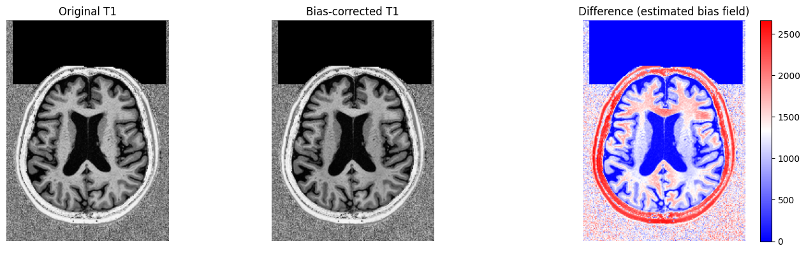
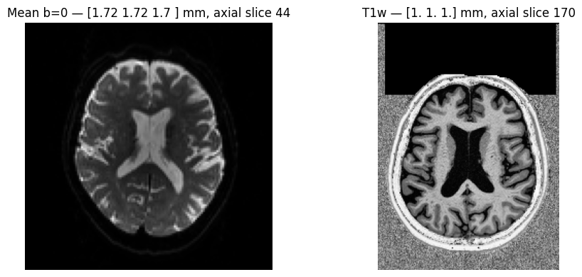
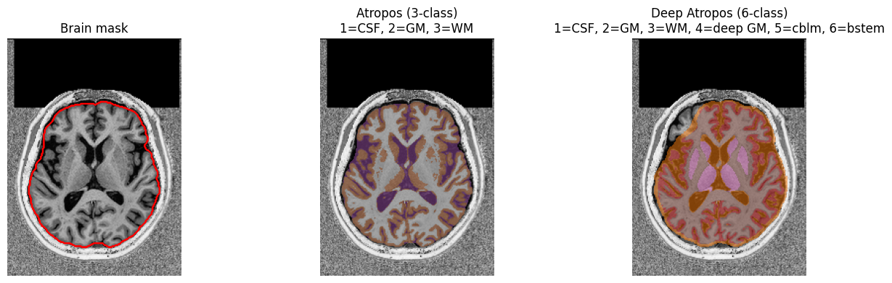
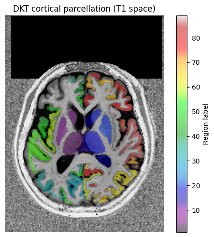
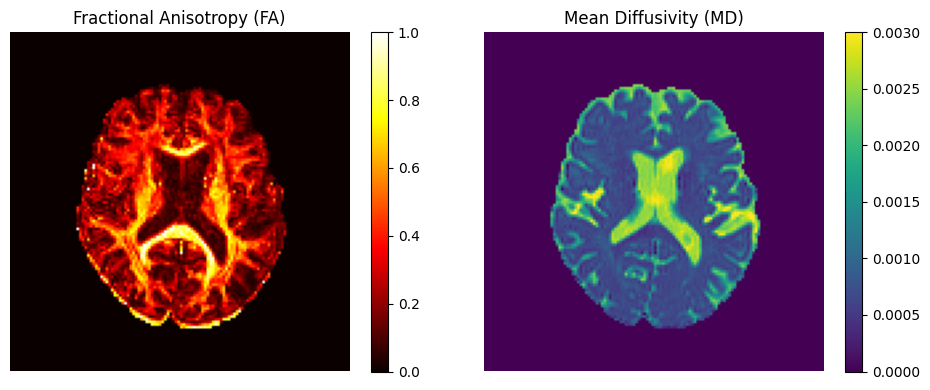
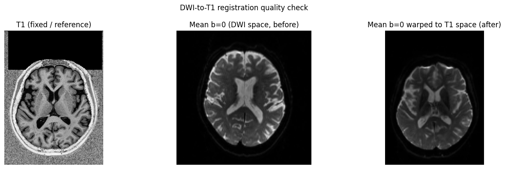
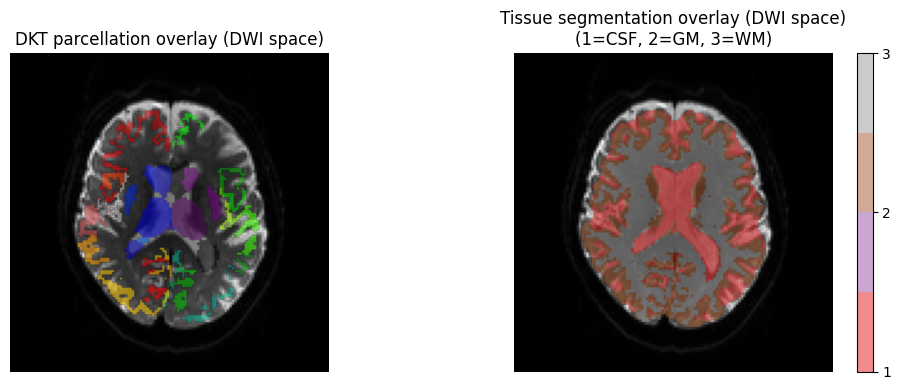

# Regional Analysis with T1 and DWI Data

This notebook demonstrates how to combine structural (T1) and diffusion (DWI) MRI
using `kwneuro` to perform brain region-level microstructure analysis. We use a
dataset from openneuro, which includes a T1 and a single-shell DWI
acquisition.

## Pipeline overview

0. Download example data
1. Load DWI and T1 data
2. T1 bias correction
3. T1 brain extraction and tissue segmentation (Atropos vs Deep Atropos)
4. Cortical parcellation (DKT atlas via ANTsPyNet)
5. DWI preprocessing: denoising, brain extraction, and DTI estimation
6. Register DWI to T1 space (rigid body)
7. Warp parcellation labels into DWI space

## 0. Download example data

We download one subject from the MPI-Leipzig Mind-Brain-Body dataset ([OpenNeuro ds000221](https://openneuro.org/datasets/ds000221)). This dataset contains 64-direction single-shell DWI data (b ~ 1000 s/mm²) and a T1-weighted structural image.

The data is downloaded automatically on first run (~100 MB).


```python
from pathlib import Path

import openneuro as on

DATA_DIR = Path("example_data/ds000221")
SUBJECT, SESSION = "sub-010002", "ses-01"

t1_path = DATA_DIR / SUBJECT / SESSION / "anat" / f"{SUBJECT}_{SESSION}_acq-mp2rage_T1w.nii.gz"
dwi_dir = DATA_DIR / SUBJECT / SESSION / "dwi"

if not t1_path.exists() or not dwi_dir.exists() or not list(dwi_dir.glob("*_dwi.nii.gz")):
    DATA_DIR.mkdir(parents=True, exist_ok=True)
    on.download(
        dataset="ds000221",
        target_dir=str(DATA_DIR),
        include=[
            "dataset_description.json",
            f"{SUBJECT}/{SESSION}/anat/*T1w*",
            f"{SUBJECT}/{SESSION}/dwi/*",
        ],
    )

dwi_nii = next(dwi_dir.glob("*_dwi.nii.gz"))
basename = dwi_nii.name.removesuffix(".nii.gz")

print(f"T1 path:      {t1_path}")
print(f"DWI dir:      {dwi_dir}")
print(f"DWI basename: {basename}")
```

## 1. Load T1 data

The T1-weighted structural image provides the anatomical reference for tissue
segmentation, cortical parcellation, and DWI co-registration.


```python
import matplotlib
import matplotlib.pyplot as plt
import numpy as np

from kwneuro.dwi import Dwi
from kwneuro.io import FslBvalResource, FslBvecResource, NiftiVolumeResource
from kwneuro.reg import register_dwi_to_structural
from kwneuro.structural import StructuralImage

structural = StructuralImage(NiftiVolumeResource(t1_path)).load()

if SUBSAMPLE:
    from kwneuro.util import subsample_volume

    structural = StructuralImage(subsample_volume(structural.volume, SUBSAMPLE_FACTOR))
    print(f"Subsampled T1 by factor {SUBSAMPLE_FACTOR}")

struct_image = structural.volume.get_array()
t1_mid = struct_image.shape[2] // 2
t1_slice = 170

print(f"T1 shape: {struct_image.shape}")
```

    T1 shape: (176, 240, 256)
    

## 2. T1 bias correction

RF field inhomogeneities create smooth intensity gradients across the T1 that
can bias tissue segmentation and parcellation. `correct_bias()` applies ANTsPy's
N4 bias field correction before downstream structural processing.


```python
structural_bc = structural.correct_bias()
```


```python
t1_bc = structural_bc.volume.get_array()

fig, axes = plt.subplots(1, 3, figsize=(14, 4))
axes[0].imshow(struct_image[:, :, t1_slice].T, cmap="gray", origin="lower")
axes[0].set_title("Original T1")
axes[1].imshow(t1_bc[:, :, t1_slice].T, cmap="gray", origin="lower")
axes[1].set_title("Bias-corrected T1")
diff = t1_bc[:,:, t1_slice] - struct_image[:, :, t1_slice]
im = axes[2].imshow(diff.T, cmap="bwr", origin="lower")
axes[2].set_title("Difference (estimated bias field)")
plt.colorbar(im, ax=axes[2], fraction=0.046)
for ax in axes:
    ax.axis("off")
plt.tight_layout()
plt.show()
```


    

    


## Load DWI data

A `Dwi` object bundles the 4D volume, b-values, and b-vectors.


```python
dwi = Dwi(
    NiftiVolumeResource(dwi_dir / f"{basename}.nii.gz"),
    FslBvalResource(dwi_dir / f"{basename}.bval"),
    FslBvecResource(dwi_dir / f"{basename}.bvec"),
).load()

vol = dwi.volume.get_array()
bvals = dwi.bval.get()
dwi_mid = vol.shape[2] // 2

print(f"DWI shape: {vol.shape}")
print(f"Unique b-values: {np.unique(np.round(bvals, -2))}")
```

    DWI shape: (128, 128, 88, 67)
    Unique b-values: [   0. 1000.]
    

The two images have very different resolutions and field-of-view sizes — the DWI
covers only a portion of the brain while the T1 spans the full volume. This is
typical of real acquisitions and is exactly what the registration step handles.


```python
t1_affine = structural_bc.volume.get_affine()
dwi_affine = dwi.volume.get_affine()

t1_vox_size = np.linalg.norm(t1_affine[:3, :3], axis=0).round(2)
dwi_vox_size = np.linalg.norm(dwi_affine[:3, :3], axis=0).round(2)

print(f"T1 voxel size:  {t1_vox_size} mm")
print(f"DWI voxel size: {dwi_vox_size} mm")

mean_b0 = dwi.compute_mean_b0()
mean_b0_arr = mean_b0.get_array()

fig, axes = plt.subplots(1, 2, figsize=(10, 4))
axes[0].imshow(mean_b0_arr[:, :, dwi_mid].T, cmap="gray", origin="lower")
axes[0].set_title(f"Mean b=0 — {dwi_vox_size} mm, axial slice {dwi_mid}")
axes[1].imshow(struct_image[:, :, t1_slice].T, cmap="gray", origin="lower")
axes[1].set_title(f"T1w — {t1_vox_size} mm, axial slice {t1_slice}")
for ax in axes:
    ax.axis("off")
plt.tight_layout()
plt.show()
```

    T1 voxel size:  [1. 1. 1.] mm
    DWI voxel size: [1.72 1.72 1.7 ] mm
    


    

    


## 3. Brain extraction and tissue segmentation

We extract a brain mask from the bias-corrected T1 using HD-BET, then compare
two tissue segmentation methods:

- **Atropos** *(default)*: classical ANTsPy k-means, 3 classes — CSF (1), GM (2), WM (3).
- **Deep Atropos**: deep-learning segmentation via ANTsPyNet, 6 classes — CSF (1),
  GM (2), WM (3), deep GM (4), cerebellum (5), brainstem (6).
  Requires `pip install kwneuro[antspynet]`.


```python
t1_mask = structural_bc.extract_brain()
```


```python
segmentation = structural_bc.segment_tissues(mask=t1_mask)
segmentation_deep = structural_bc.segment_tissues(method="deep_atropos")

seg_arr = segmentation.get_array()
seg_deep_arr = segmentation_deep.get_array()
t1_mask_arr = t1_mask.get_array()

t1_slc = t1_bc[:, :, t1_slice].T

fig, axes = plt.subplots(1, 3, figsize=(14, 4))

axes[0].imshow(t1_slc, cmap="gray", origin="lower")
axes[0].contour(t1_mask_arr[:, :, t1_slice].T, colors="red", linewidths=0.8)
axes[0].set_title("Brain mask")

axes[1].imshow(t1_slc, cmap="gray", origin="lower")
axes[1].imshow(
    np.ma.masked_equal(seg_arr[:, :, t1_slice].T, 0),
    cmap=matplotlib.colormaps.get_cmap("Set1").resampled(4),
    origin="lower",
    vmin=0,
    vmax=3,
    alpha=0.5,
)
axes[1].set_title("Atropos (3-class)\n1=CSF, 2=GM, 3=WM")

axes[2].imshow(t1_slc, cmap="gray", origin="lower")
axes[2].imshow(
    np.ma.masked_equal(seg_deep_arr[:, :, t1_slice].T, 0),
    cmap=matplotlib.colormaps.get_cmap("tab10").resampled(7),
    origin="lower",
    vmin=0,
    vmax=6,
    alpha=0.5,
)
axes[2].set_title("Deep Atropos (6-class)\n1=CSF, 2=GM, 3=WM, 4=deep GM, 5=cblm, 6=bstem")

for ax in axes:
    ax.axis("off")
plt.tight_layout()
plt.show()
```


    

    


## 4. Cortical parcellation (DKT atlas)

`parcellate(method="dkt")` applies the Desikan-Killiany-Tourville (DKT) cortical
labeling via ANTsPyNet. A deep learning model assigns each cortical voxel to one of
approximately 84 regions directly from the T1 image.

> **Note:** This step requires `pip install kwneuro[antspynet]` and sufficient RAM
> (~8 GB free) to run the deep-learning model on a full-resolution T1.


```python
parcellation = structural_bc.parcellate(method="dkt")
```


```python
parc_arr = parcellation.get_array()

# Remap labels to sequential 1-N
labels_present = np.unique(parc_arr)
labels_present = labels_present[labels_present != 0] 
label_to_idx = {label: idx + 1 for idx, label in enumerate(labels_present)}
parc_remapped = np.vectorize(label_to_idx.get)(parc_arr, 0)  # 0 stays as background

print(f"Parcellation shape: {parc_arr.shape}")
print(f"Distinct labels (including background 0): {len(labels_present)}")

fig, ax = plt.subplots(figsize=(6, 5))
ax.imshow(t1_bc[:, :, t1_slice].T, cmap="gray", origin="lower")
im = ax.imshow(
    np.ma.masked_equal(parc_remapped[:, :, t1_slice].T, 0),
    cmap="nipy_spectral",
    origin="lower",
    alpha=0.5,
    vmin=1,
    vmax=len(labels_present),
)
ax.set_title("DKT cortical parcellation (T1 space)")
ax.axis("off")
plt.colorbar(im, ax=ax, fraction=0.046, label="Region label")
plt.tight_layout()
plt.show()
```

    Parcellation shape: (176, 240, 256)
    Distinct labels (including background 0): 89
    


    

    


## 5. DWI preprocessing

Three steps prepare the DWI for registration and DTI estimation: Patch2Self
denoising, HD-BET brain extraction, and DIPY TensorModel fitting.


```python
dwi_denoised = dwi.denoise()
```


```python
dwi_mask = dwi_denoised.extract_brain()
```


```python
dti = dwi_denoised.estimate_dti(mask=dwi_mask)
fa_vol, md_vol = dti.get_fa_md()
fa = fa_vol.get_array()
md = md_vol.get_array()

mean_b0_denoised = dwi_denoised.compute_mean_b0()
mean_b0_denoised_arr = mean_b0_denoised.get_array()

fig, axes = plt.subplots(1, 2, figsize=(10, 4))
im1 = axes[0].imshow(fa[:, :, dwi_mid].T, cmap="hot", origin="lower", vmin=0, vmax=1)
axes[0].set_title("Fractional Anisotropy (FA)")
plt.colorbar(im1, ax=axes[0], fraction=0.046)
im2 = axes[1].imshow(
    md[:, :, dwi_mid].T, cmap="viridis", origin="lower", vmin=0, vmax=3e-3
)
axes[1].set_title("Mean Diffusivity (MD)")
plt.colorbar(im2, ax=axes[1], fraction=0.046)
for ax in axes:
    ax.axis("off")
plt.tight_layout()
plt.show()
```


    

    


## 6. Register DWI to T1 space (rigid body)

A rigid-body transform aligns the mean b=0 image to the T1.
A rigid transform is appropriate here because the DWI and T1 were
acquired in the same session — we only need to correct for minor inter-sequence
head motion.


```python
transform = register_dwi_to_structural(
    dwi=dwi_denoised,
    structural=structural_bc,
    type_of_transform="SyN",
    dwi_mask=dwi_mask,
    structural_mask=t1_mask,
)
```


```python
# Verify registration quality: warp the mean b=0 forward into T1 space
registered_b0 = transform.apply(
    fixed=structural_bc.volume,
    moving=mean_b0_denoised,
)
reg_arr = registered_b0.get_array()

fig, axes = plt.subplots(1, 3, figsize=(14, 4))
axes[0].imshow(t1_bc[:, :, t1_slice].T, cmap="gray", origin="lower")
axes[0].set_title("T1 (fixed / reference)")
axes[1].imshow(mean_b0_denoised_arr[:, :, dwi_mid].T, cmap="gray", origin="lower")
axes[1].set_title("Mean b=0 (DWI space, before)")
axes[2].imshow(reg_arr[:, :, t1_slice].T, cmap="gray", origin="lower")
axes[2].set_title("Mean b=0 warped to T1 space (after)")
for ax in axes:
    ax.axis("off")
plt.suptitle("DWI-to-T1 registration quality check")
plt.tight_layout()
plt.show()
```


    

    


## 7. Warp labels into DWI space

To analyse DTI values per brain region we need the parcel labels in the same
space as the DTI maps. We apply the *inverse* of the DWI→T1 transform to warp
both the DKT parcellation and the Atropos tissue segmentation into DWI space.

`interpolation="genericLabel"` uses nearest-neighbour resampling, which preserves
integer label values without blending across region boundaries.


```python
parcellation_dwi = transform.apply(
    fixed=mean_b0_denoised,
    moving=parcellation,
    invert=True,
    interpolation="genericLabel",
)
parc_dwi_arr = parcellation_dwi.get_array()

labels_present = np.unique(parc_dwi_arr)
labels_present = labels_present[labels_present != 0] 
label_to_idx = {label: idx + 1 for idx, label in enumerate(labels_present)}
parc_dwi_remapped = np.vectorize(label_to_idx.get)(parc_dwi_arr, 0)  # 0 stays as background

segmentation_dwi = transform.apply(
    fixed=mean_b0_denoised,
    moving=segmentation,
    invert=True,
    interpolation="genericLabel",
)
seg_dwi_arr = segmentation_dwi.get_array()

fig, axes = plt.subplots(1, 2, figsize=(10, 4))

axes[0].imshow(mean_b0_denoised_arr[:, :, dwi_mid].T, cmap="gray", origin="lower")
axes[0].imshow(
    np.ma.masked_equal(parc_dwi_remapped[:, :, 40], 0).T,
    cmap="nipy_spectral",
    origin="lower",
    alpha=0.55,
)
axes[0].set_title("DKT parcellation overlay (DWI space)")
axes[0].axis("off")

seg_cmap = matplotlib.colormaps.get_cmap("Set1").resampled(4)
axes[1].imshow(mean_b0_denoised_arr[:, :, dwi_mid].T, cmap="gray", origin="lower")
im = axes[1].imshow(
    np.ma.masked_equal(seg_dwi_arr[:, :, dwi_mid], 0).T,
    cmap=seg_cmap,
    origin="lower",
    vmin=1,
    vmax=3,
    alpha=0.5,
)
axes[1].set_title("Tissue segmentation overlay (DWI space)\n(1=CSF, 2=GM, 3=WM)")
axes[1].axis("off")
plt.colorbar(im, ax=axes[1], fraction=0.046, ticks=[1, 2, 3])

plt.tight_layout()
plt.show()
```


    

    

